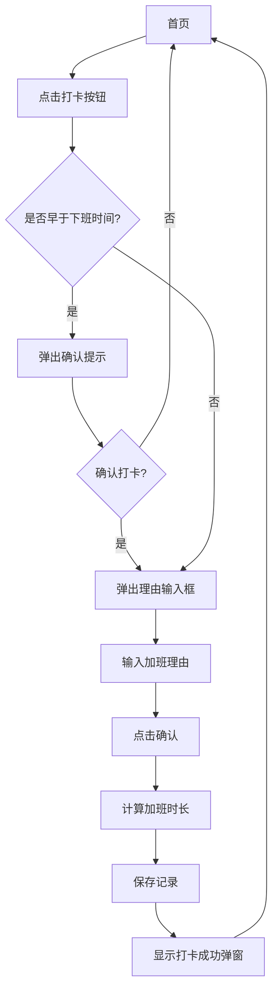
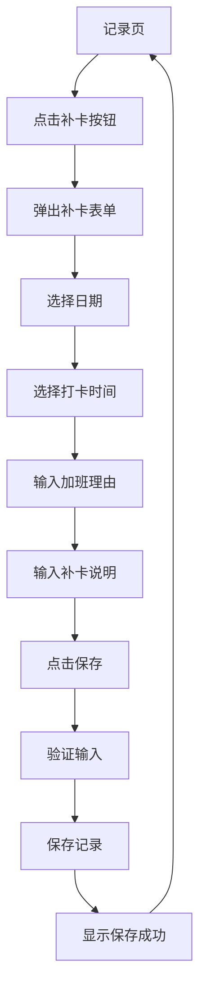
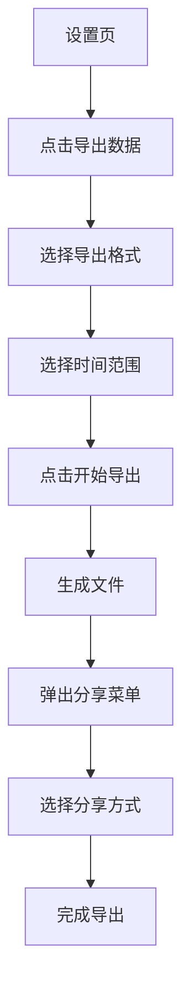

# 加班记 (Overtime Tracker) 原型图与交互说明

**文档版本**: v1.0.0  
**撰写日期**: 2026-03-14  
**文档状态**: 评审中  

---

## 目录

1. [设计风格](#1-设计风格)
2. [页面原型图](#2-页面原型图)
3. [交互流程](#3-交互流程)
4. [关键场景演示](#4-关键场景演示)

---

## 1. 设计风格

### 1.1 视觉风格

| 元素 | 说明 |
|------|------|
| **主色调** | 深蓝 (#1E3A5F) + 琥珀色 (#F5A623) |
| **辅助色** | 浅灰 (#F5F5F5)、中灰 (#E0E0E0)、深灰 (#424242) |
| **字体** | 中文：思源黑体  
英文：Roboto |
| **字体大小** | 标题：18-20px  
正文：14-16px  
小字：12px |
| **圆角** | 卡片：12px  
按钮：8px |
| **阴影** | 柔和阴影，透明度 10-15% |
| **图标** | 线性图标，24px 统一尺寸 |

### 1.2 设计原则

- **简洁明了**：核心功能突出，减少视觉干扰
- **高效操作**：关键操作（如打卡）一键完成
- **数据可视化**：通过图表直观展示加班趋势
- **响应式设计**：适配不同屏幕尺寸

---

## 2. 页面原型图

### 2.1 首页 - 打卡中心

**页面布局**:

```
┌─────────────────────────────────────┐
│  状态栏 (44px)                       │
├─────────────────────────────────────┤
│  顶部标题 (56px)                      │
│  ┌─────────────────────────────┐   │
│  │        加班记               │   │
│  └─────────────────────────────┘   │
├─────────────────────────────────────┤
│  今日状态卡片 (160px)                 │
│  ┌─────────────────────────────┐   │
│  │  ┌───────────────────────┐  │   │
│  │  │  🌙 今日未打卡         │  │   │
│  │  └───────────────────────┘  │   │
│  │                             │   │
│  │  ┌───────────────────────┐  │   │
│  │  │  标准工时: 09:00-18:00 │  │   │
│  │  └───────────────────────┘  │   │
│  │                             │   │
│  │  ┌───────────────────────┐  │   │
│  │  │  上次打卡: 昨天 20:30  │  │   │
│  │  └───────────────────────┘  │   │
│  └─────────────────────────────┘   │
├─────────────────────────────────────┤
│  打卡按钮 (120px)                     │
│  ┌─────────────────────────────┐   │
│  │        [ 打卡 ]            │   │
│  │        (大按钮)            │   │
│  └─────────────────────────────┘   │
├─────────────────────────────────────┤
│  最近记录 (可变高度)                    │
│  ┌─────────────────────────────┐   │
│  │        最近打卡记录         │   │
│  └─────────────────────────────┘   │
│  ┌─────────────────────────────┐   │
│  │  昨天  20:30  2.5h          │   │
│  │  项目上线准备              │   │
│  └─────────────────────────────┘   │
│  ┌─────────────────────────────┐   │
│  │  周三  21:00  3.0h          │   │
│  │  需求评审会议              │   │
│  └─────────────────────────────┘   │
├─────────────────────────────────────┤
│  底部导航栏 (56px)                    │
│  ┌───────┬───────┬───────┬───────┐ │
│  │  首页  │  统计  │  记录  │  设置  │ │
│  └───────┴───────┴───────┴───────┘ │
└─────────────────────────────────────┘
```

**元素说明**:
- **今日状态卡片**：白底，圆角 12px，阴影效果
- **打卡按钮**：主色调填充，琥珀色文字，居中大按钮
- **最近记录**：卡片式列表，间距 8px

### 2.2 统计页 - 数据洞察

**页面布局**:

```
┌─────────────────────────────────────┐
│  状态栏 (44px)                       │
├─────────────────────────────────────┤
│  顶部标题 (56px)                      │
│  ┌─────────────────────────────┐   │
│  │        数据统计             │   │
│  └─────────────────────────────┘   │
├─────────────────────────────────────┤
│  维度切换 (48px)                      │
│  ┌───────┬───────┬───────┬───────┐ │
│  │  日   │  周   │  月   │  年   │ │
│  └───────┴───────┴───────┴───────┘ │
├─────────────────────────────────────┤
│  指标卡片 (120px)                     │
│  ┌─────────────┬─────────────┐     │
│  │  总时长:     │  打卡天数:  │     │
│  │  12.5h      │  5天        │     │
│  └─────────────┴─────────────┘     │
├─────────────────────────────────────┤
│  图表区域 (300px)                     │
│  ┌─────────────────────────────┐   │
│  │         [ 柱状图 ]         │   │
│  └─────────────────────────────┘   │
├─────────────────────────────────────┤
│  详细列表 (可变高度)                    │
│  ┌─────────────────────────────┐   │
│  │  周一  19:30  1.5h          │   │
│  │  代码Review                │   │
│  └─────────────────────────────┘   │
├─────────────────────────────────────┤
│  底部导航栏 (56px)                    │
└─────────────────────────────────────┘
```

**元素说明**:
- **维度切换**：Tab 式切换，当前选中项下划线标记
- **指标卡片**：双栏布局，数字突出显示
- **图表区域**：响应式图表，支持横向滚动

### 2.3 记录页 - 历史管理

**页面布局**:

```
┌─────────────────────────────────────┐
│  状态栏 (44px)                       │
├─────────────────────────────────────┤
│  顶部标题 (56px)                      │
│  ┌──────────────────────┬────────┐  │
│  │        打卡记录       │ [+]补卡 │  │
│  └──────────────────────┴────────┘  │
├─────────────────────────────────────┤
│  月份分组标题                        │
│  ┌─────────────────────────────┐   │
│  │        2026年3月          │   │
│  └─────────────────────────────┘   │
├─────────────────────────────────────┤
│  记录列表项                          │
│  ┌─────────────────────────────┐   │
│  │  3月14日 周五  20:30       │   │
│  │  加班时长: 2.5h            │   │
│  │  理由: 项目上线            │   │
│  │  [编辑] [删除]             │   │
│  └─────────────────────────────┘   │
├─────────────────────────────────────┤
│  月份分组标题                        │
│  ┌─────────────────────────────┐   │
│  │        2026年2月          │   │
│  └─────────────────────────────┘   │
├─────────────────────────────────────┤
│  记录列表项                          │
│  ┌─────────────────────────────┐   │
│  │  2月28日 周四  21:00       │   │
│  │  加班时长: 3.0h            │   │
│  │  理由: 需求评审            │   │
│  │  [补卡]                    │   │
│  └─────────────────────────────┘   │
├─────────────────────────────────────┤
│  底部导航栏 (56px)                    │
└─────────────────────────────────────┘
```

**元素说明**:
- **补卡按钮**：右上角「+」图标，点击弹出补卡表单
- **月份分组**：灰色背景，加粗字体
- **记录项**：卡片式设计，补卡记录有特殊标识

### 2.4 设置页 - 系统配置

**页面布局**:

```
┌─────────────────────────────────────┐
│  状态栏 (44px)                       │
├─────────────────────────────────────┤
│  顶部标题 (56px)                      │
│  ┌─────────────────────────────┐   │
│  │        系统设置             │   │
│  └─────────────────────────────┘   │
├─────────────────────────────────────┤
│  设置项分组                          │
│  ┌─────────────────────────────┐   │
│  │        工作时间设置         │   │
│  └─────────────────────────────┘   │
│  ┌─────────────────────────────┐   │
│  │  上午上班: 09:00           │   │
│  └─────────────────────────────┘   │
│  ┌─────────────────────────────┐   │
│  │  上午下班: 12:00           │   │
│  └─────────────────────────────┘   │
│  ┌─────────────────────────────┐   │
│  │  下午上班: 14:00           │   │
│  └─────────────────────────────┘   │
│  ┌─────────────────────────────┐   │
│  │  下午下班: 18:00           │   │
│  └─────────────────────────────┘   │
├─────────────────────────────────────┤
│  设置项分组                          │
│  ┌─────────────────────────────┐   │
│  │        数据管理             │   │
│  └─────────────────────────────┘   │
│  ┌─────────────────────────────┐   │
│  │  导出数据                  │   │
│  └─────────────────────────────┘   │
│  ┌─────────────────────────────┐   │
│  │  备份数据                  │   │
│  └─────────────────────────────┘   │
│  ┌─────────────────────────────┐   │
│  │  恢复数据                  │   │
│  └─────────────────────────────┘   │
├─────────────────────────────────────┤
│  底部导航栏 (56px)                    │
└─────────────────────────────────────┘
```

**元素说明**:
- **设置项**：分组展示，点击进入详情页
- **时间设置**：点击弹出时间选择器
- **数据管理**：包含导出、备份、恢复功能

---

## 3. 交互流程

### 3.1 核心操作流程

#### 3.1.1 打卡流程



**交互细节**:
- 点击打卡按钮：按钮有按压反馈
- 早于下班时间：弹出警告提示，确认后继续
- 理由输入框：支持文本输入，字数限制 50 字
- 打卡成功：显示 Toast 提示，更新今日状态

#### 3.1.2 补打卡流程



**交互细节**:
- 日期选择：日历组件，只能选择过去日期
- 时间选择：时间选择器，精确到分钟
- 补卡说明：必填项，最少 10 字
- 验证失败：提示错误信息，高亮错误字段

#### 3.1.3 数据导出流程



**交互细节**:
- 格式选择：Excel / PDF 二选一
- 时间范围：默认全部，可自定义起止日期
- 导出中：显示加载动画
- 分享菜单：系统原生分享，支持保存到本地

### 3.2 页面导航

| 页面 | 进入方式 | 退出方式 |
|------|----------|----------|
| 首页 | App 启动、底部导航 | 底部导航切换 |
| 统计页 | 底部导航 | 底部导航切换 |
| 记录页 | 底部导航 | 底部导航切换 |
| 设置页 | 底部导航 | 底部导航切换 |
| 补卡表单 | 记录页「+」按钮 | 保存/取消 |
| 工时设置 | 设置页点击 | 保存/返回 |
| 导出页面 | 设置页点击 | 完成/返回 |

---

## 4. 关键场景演示

### 4.1 场景一：日常加班打卡

**用户操作**:
1. 打开 App 进入首页
2. 点击「打卡」按钮
3. 系统自动获取当前时间（20:30）
4. 弹出理由输入框，输入「项目上线准备」
5. 点击「确认」按钮

**系统反馈**:
- 计算加班时长：20:30 - 18:00 = 2.5 小时
- 保存打卡记录
- 显示「打卡成功，加班 2.5 小时」的 Toast 提示
- 今日状态卡片更新为「已打卡」
- 最近记录列表新增一条记录

### 4.2 场景二：月末统计导出

**用户操作**:
1. 进入统计页，切换到「月」视图
2. 查看本月加班总时长（25 小时）
3. 进入设置页，点击「导出数据」
4. 选择 Excel 格式，时间范围选择「本月」
5. 点击「开始导出」

**系统反馈**:
- 生成 Excel 文件，包含本月所有打卡记录
- 弹出系统分享菜单
- 用户选择「保存到文件」或「发送给微信」
- 显示「导出成功」提示

### 4.3 场景三：补录加班记录

**用户操作**:
1. 进入记录页，点击右上角「+」按钮
2. 选择日期（3月10日）
3. 设置打卡时间（21:00）
4. 输入加班理由「需求评审会议」
5. 输入补卡说明「当时忘记打卡，现在补录」
6. 点击「保存」按钮

**系统反馈**:
- 验证输入信息
- 保存补打卡记录（标记为补卡）
- 记录列表中显示该条记录，并有「补卡」标识
- 显示「补卡成功」提示

---

## 5. 设计资源

### 5.1 图标资源

| 图标 | 用途 | 样式 |
|------|------|------|
| 打卡图标 | 首页打卡按钮 | 时钟 + 对勾 |
| 统计图标 | 统计页 Tab | 图表柱状图 |
| 记录图标 | 记录页 Tab | 列表 |
| 设置图标 | 设置页 Tab | 齿轮 |
| 加号图标 | 补卡按钮 | + |
| 导出图标 | 导出功能 | 下载 |
| 备份图标 | 备份功能 | 云上传 |
| 恢复图标 | 恢复功能 | 云下载 |

### 5.2 颜色代码

| 颜色名称 | 十六进制 | 用途 |
|----------|----------|------|
| 主色深蓝 | #1E3A5F | 导航栏、按钮 |
| 强调琥珀色 | #F5A623 | 文字、图标 |
| 背景浅灰 | #F5F5F5 | 页面背景 |
| 卡片白色 | #FFFFFF | 卡片背景 |
| 文字深色 | #333333 | 主要文字 |
| 文字浅色 | #666666 | 次要文字 |
| 边框灰色 | #E0E0E0 | 分割线 |

---

**文档结束**