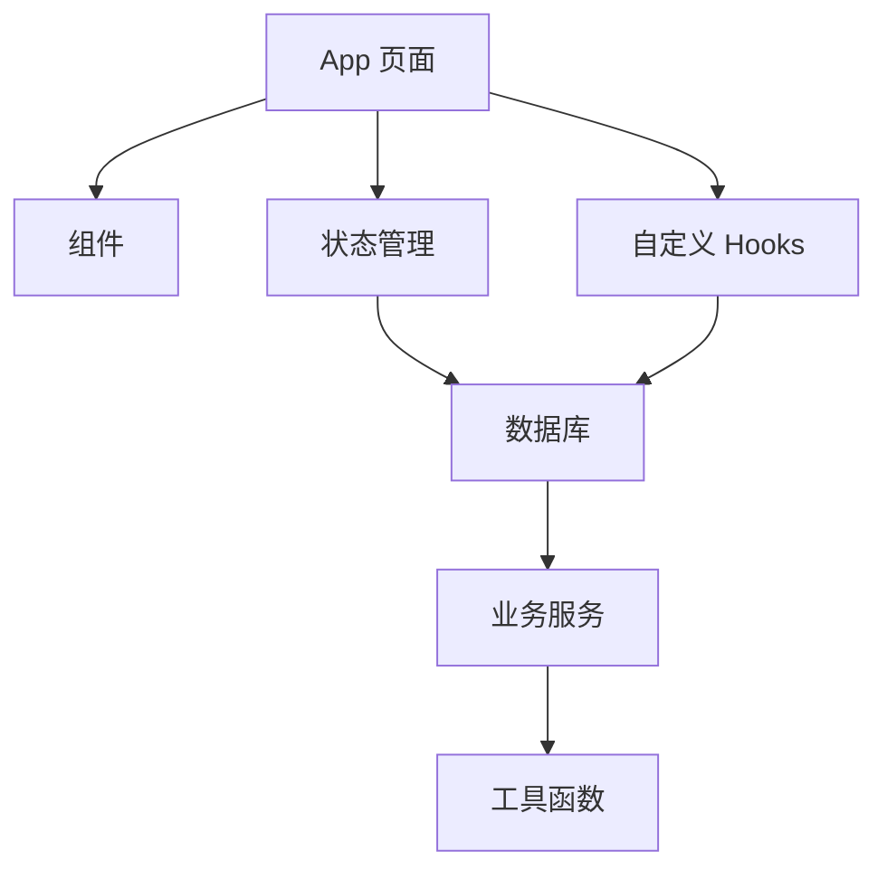

# 加班记 (Overtime Tracker) 技术方案文档

**文档版本**: v1.0.0  
**撰写日期**: 2026-03-14  
**文档状态**: 评审中  
**技术负责人**: [待填写]  
**开发团队**: [待填写]

---

## 文档修订记录

| 版本 | 日期 | 修订人 | 修订内容 |
|------|------|--------|----------|
| v1.0.0 | 2026-03-14 | [待填写] | 初稿创建 |

---

## 目录

1. [技术栈选择](#1-技术栈选择)
2. [项目架构设计](#2-项目架构设计)
3. [核心模块实现](#3-核心模块实现)
4. [数据库设计](#4-数据库设计)
5. [关键算法](#5-关键算法)
6. [性能优化策略](#6-性能优化策略)
7. [部署与发布](#7-部署与发布)
8. [测试计划](#8-测试计划)
9. [风险评估](#9-风险评估)

---

## 1. 技术栈选择

### 1.1 核心技术

| 技术 | 版本 | 选型理由 |
|------|------|----------|
| **React Native** | 0.75.0 | 跨平台开发，一次编写多平台运行 |
| **Expo SDK** | 51.0.0 | 简化开发流程，提供丰富的内置功能 |
| **TypeScript** | 5.0.0+ | 类型安全，提高代码质量和可维护性 |
| **Zustand** | 4.5.0 | 轻量级状态管理，性能优异，API简洁 |
| **SQLite** | expo-sqlite | 本地结构化存储，支持复杂查询 |
| **React Navigation** | 6.0.0+ | 原生导航体验，支持底部标签导航 |
| **React Native Paper** | 5.0.0+ | Material Design 组件库，UI一致性 |
| **react-native-chart-kit** | 6.12.0 | 数据可视化，支持多种图表类型 |
| **xlsx** | 0.18.5 | Excel 文件生成 |
| **react-native-pdf-lib** | 1.0.0+ | PDF 文件生成 |
| **expo-sharing** | 11.0.0 | 系统分享功能 |
| **expo-notifications** | 0.29.0 | 本地通知功能 |

### 1.2 开发工具

| 工具 | 用途 |
|------|------|
| **VS Code** | 代码编辑器 |
| **Expo Go** | 真机调试 |
| **Android Studio** | Android 模拟器 |
| **Xcode** | iOS 模拟器（仅 macOS） |
| **Git** | 版本控制 |

---

## 2. 项目架构设计

### 2.1 项目结构

```
overtime-tracker/
├── app/                          # Expo Router 页面
│   ├── (tabs)/                   # 底部导航页面组
│   │   ├── index.tsx             # 首页 - 打卡
│   │   ├── statistics.tsx        # 统计页面
│   │   ├── records.tsx           # 记录列表
│   │   └── settings.tsx          # 设置页面
│   ├── _layout.tsx               # 根布局
│   └── modal/                    # 模态页面
│       ├── punch.tsx             # 打卡弹窗
│       ├── makeup.tsx            # 补打卡页面
│       └── export.tsx            # 导出页面
├── components/                   # 组件
│   ├── ui/                       # 基础UI组件
│   │   ├── StatusCard.tsx        # 状态卡片
│   │   ├── PunchButton.tsx       # 打卡按钮
│   │   └── RecordItem.tsx        # 记录项
│   ├── charts/                   # 图表组件
│   │   ├── BarChart.tsx          # 柱状图
│   │   ├── LineChart.tsx         # 折线图
│   │   └── PieChart.tsx          # 饼图
│   └── forms/                    # 表单组件
│       ├── TimePicker.tsx        # 时间选择器
│       └── DatePicker.tsx        # 日期选择器
├── hooks/                        # 自定义 Hooks
│   ├── useOvertime.ts            # 加班相关逻辑
│   ├── useStatistics.ts          # 统计相关逻辑
│   └── useDatabase.ts            # 数据库操作
├── stores/                       # Zustand 状态管理
│   ├── overtimeStore.ts          # 加班记录状态
│   ├── settingsStore.ts          # 用户设置状态
│   └── statisticsStore.ts        # 统计数据状态
├── database/                     # 数据库相关
│   ├── index.ts                  # 数据库初始化
│   ├── schema.ts                 # 表结构定义
│   ├── migrations.ts             # 数据库迁移
│   └── repositories/             # 数据访问层
│       ├── recordRepository.ts   # 记录操作
│       └── settingsRepository.ts # 设置操作
├── services/                     # 业务逻辑
│   ├── overtime.service.ts       # 加班计算服务
│   ├── export.service.ts         # 导出服务
│   ├── statistics.service.ts     # 统计服务
│   └── notification.service.ts   # 通知服务
├── utils/                        # 工具函数
│   ├── time.ts                   # 时间处理
│   ├── date.ts                   # 日期处理
│   └── format.ts                 # 格式化
├── constants/                    # 常量配置
│   ├── colors.ts                 # 颜色常量
│   ├── defaultSettings.ts        # 默认设置
│   └── regex.ts                  # 正则表达式
├── types/                        # TypeScript 类型定义
│   ├── record.ts                 # 记录类型
│   ├── settings.ts               # 设置类型
│   └── statistics.ts             # 统计类型
└── assets/                       # 静态资源
    ├── icons/                    # 图标
    └── fonts/                    # 字体
```

### 2.2 模块依赖关系



### 2.3 数据流设计


---

## 3. 核心模块实现

### 3.1 打卡模块

#### 3.1.1 功能点

- 一键打卡（记录当前时间）
- 加班时长自动计算
- 打卡理由填写
- 补打卡功能

#### 3.1.2 实现方案

```typescript
// services/overtime.service.ts
export class OvertimeService {
  // 计算加班时长
  calculateOvertime(punchTime: Date, workEndTime: string): number {
    const [endHour, endMinute] = workEndTime.split(':').map(Number);
    const workEnd = new Date(punchTime);
    workEnd.setHours(endHour, endMinute, 0, 0);
    
    const diffMs = punchTime.getTime() - workEnd.getTime();
    return Math.max(0, Math.floor(diffMs / (1000 * 60)));
  }

  // 创建打卡记录
  async createRecord(punchTime: Date, reason: string, isMakeup = false, makeupNote?: string) {
    const settings = await settingsRepository.getSettings();
    const workEndTime = this.getWorkEndTime(punchTime);
    const overtimeMinutes = this.calculateOvertime(punchTime, workEndTime);
    
    const record: OvertimeRecord = {
      id: uuidv4(),
      date: formatDate(punchTime),
      punchTime: formatTime(punchTime),
      workStartMorning: settings.morningStart,
      workEndMorning: settings.morningEnd,
      workStartAfternoon: settings.afternoonStart,
      workEndAfternoon: settings.afternoonEnd,
      overtimeMinutes,
      reason,
      isMakeup,
      makeupNote,
      createdAt: Date.now(),
      updatedAt: Date.now()
    };
    
    return await recordRepository.create(record);
  }
}
```

### 3.2 统计模块

#### 3.2.1 功能点

- 多维度数据统计（日/周/月/年）
- 数据可视化图表
- 自定义时间段统计

#### 3.2.2 实现方案

```typescript
// services/statistics.service.ts
export class StatisticsService {
  // 按日统计
  async getDailyStats(date: string) {
    const records = await recordRepository.getByDate(date);
    return {
      totalMinutes: records.reduce((sum, r) => sum + r.overtimeMinutes, 0),
      records
    };
  }

  // 按周统计
  async getWeeklyStats(startDate: string, endDate: string) {
    const records = await recordRepository.getByDateRange(startDate, endDate);
    const dailyStats = this.groupByDate(records);
    
    return {
      totalMinutes: records.reduce((sum, r) => sum + r.overtimeMinutes, 0),
      days: Object.keys(dailyStats).length,
      dailyStats
    };
  }

  // 生成图表数据
  generateChartData(records: OvertimeRecord[], type: 'bar' | 'line' | 'pie') {
    switch (type) {
      case 'bar':
        return this.generateBarChartData(records);
      case 'line':
        return this.generateLineChartData(records);
      case 'pie':
        return this.generatePieChartData(records);
      default:
        return {};
    }
  }
}
```

### 3.3 导出模块

#### 3.3.1 功能点

- Excel 格式导出
- PDF 格式导出
- 系统分享

#### 3.3.2 实现方案

```typescript
// services/export.service.ts
export class ExportService {
  // 导出为 Excel
  async exportToExcel(records: OvertimeRecord[], startDate: string, endDate: string) {
    const worksheet = XLSX.utils.json_to_sheet(records.map(r => ({
      '日期': r.date,
      '打卡时间': r.punchTime,
      '加班时长(小时)': (r.overtimeMinutes / 60).toFixed(1),
      '理由': r.reason,
      '是否补卡': r.isMakeup ? '是' : '否',
      '补卡说明': r.makeupNote || ''
    })));
    
    const workbook = XLSX.utils.book_new();
    XLSX.utils.book_append_sheet(workbook, worksheet, '加班记录');
    
    const excelBuffer = XLSX.write(workbook, { bookType: 'xlsx', type: 'array' });
    const fileUri = await this.saveFile(excelBuffer, `加班记录_${startDate}_${endDate}.xlsx`);
    
    return fileUri;
  }

  // 导出为 PDF
  async exportToPDF(records: OvertimeRecord[], startDate: string, endDate: string) {
    // 使用 react-native-pdf-lib 生成 PDF
    // ...
    return fileUri;
  }

  // 分享文件
  async shareFile(fileUri: string) {
    await Sharing.shareAsync(fileUri);
  }
}
```

### 3.4 设置模块

#### 3.4.1 功能点

- 工作时间配置
- 工作日设置
- 提醒设置

#### 3.4.2 实现方案

```typescript
// stores/settingsStore.ts
import { create } from 'zustand';

interface SettingsState {
  settings: UserSettings;
  loading: boolean;
  
  loadSettings: () => Promise<void>;
  updateSettings: (settings: Partial<UserSettings>) => Promise<void>;
  resetSettings: () => Promise<void>;
}

export const useSettingsStore = create<SettingsState>((set, get) => ({
  settings: DEFAULT_SETTINGS,
  loading: false,
  
  loadSettings: async () => {
    set({ loading: true });
    try {
      const settings = await settingsRepository.getSettings();
      set({ settings });
    } catch (error) {
      console.error('加载设置失败:', error);
    } finally {
      set({ loading: false });
    }
  },
  
  updateSettings: async (updates) => {
    const currentSettings = get().settings;
    const newSettings = { ...currentSettings, ...updates };
    
    try {
      await settingsRepository.update(newSettings);
      set({ settings: newSettings });
    } catch (error) {
      console.error('更新设置失败:', error);
    }
  },
  
  resetSettings: async () => {
    try {
      await settingsRepository.update(DEFAULT_SETTINGS);
      set({ settings: DEFAULT_SETTINGS });
    } catch (error) {
      console.error('重置设置失败:', error);
    }
  }
}));
```

---

## 4. 数据库设计

### 4.1 表结构

#### 4.1.1 打卡记录表 (overtime_records)

| 字段 | 类型 | 约束 | 说明 |
|------|------|------|------|
| id | TEXT | PRIMARY KEY | UUID v4 |
| date | TEXT | NOT NULL | 日期 (YYYY-MM-DD) |
| punch_time | TEXT | NOT NULL | 打卡时间 (HH:mm) |
| work_start_morning | TEXT | NOT NULL | 上午上班时间 |
| work_end_morning | TEXT | NOT NULL | 上午下班时间 |
| work_start_afternoon | TEXT | NOT NULL | 下午上班时间 |
| work_end_afternoon | TEXT | NOT NULL | 下午下班时间 |
| overtime_minutes | INTEGER | NOT NULL | 加班时长（分钟） |
| reason | TEXT | NOT NULL | 加班理由 |
| is_makeup | INTEGER | NOT NULL | 是否补打卡 (0/1) |
| makeup_note | TEXT | | 补卡说明 |
| created_at | INTEGER | NOT NULL | 创建时间戳 |
| updated_at | INTEGER | NOT NULL | 更新时间戳 |

#### 4.1.2 用户设置表 (user_settings)

| 字段 | 类型 | 约束 | 说明 |
|------|------|------|------|
| id | INTEGER | PRIMARY KEY | 固定为 1 |
| morning_start | TEXT | NOT NULL | 上午上班时间 |
| morning_end | TEXT | NOT NULL | 上午下班时间 |
| afternoon_start | TEXT | NOT NULL | 下午上班时间 |
| afternoon_end | TEXT | NOT NULL | 下午下班时间 |
| work_days | TEXT | NOT NULL | 工作日 JSON 数组 |
| reminder_enabled | INTEGER | NOT NULL | 提醒开关 (0/1) |
| reminder_time | INTEGER | | 提醒时间（分钟） |
| updated_at | INTEGER | NOT NULL | 更新时间戳 |

### 4.2 数据库初始化

```typescript
// database/index.ts
import * as SQLite from 'expo-sqlite';

const db = SQLite.openDatabase('overtime.db');

export const initDatabase = async () => {
  return new Promise<void>((resolve, reject) => {
    db.transaction(tx => {
      // 创建打卡记录表
      tx.executeSql(
        `CREATE TABLE IF NOT EXISTS overtime_records (
          id TEXT PRIMARY KEY,
          date TEXT NOT NULL,
          punch_time TEXT NOT NULL,
          work_start_morning TEXT NOT NULL,
          work_end_morning TEXT NOT NULL,
          work_start_afternoon TEXT NOT NULL,
          work_end_afternoon TEXT NOT NULL,
          overtime_minutes INTEGER NOT NULL,
          reason TEXT NOT NULL,
          is_makeup INTEGER NOT NULL,
          makeup_note TEXT,
          created_at INTEGER NOT NULL,
          updated_at INTEGER NOT NULL
        );`
      );
      
      // 创建用户设置表
      tx.executeSql(
        `CREATE TABLE IF NOT EXISTS user_settings (
          id INTEGER PRIMARY KEY,
          morning_start TEXT NOT NULL,
          morning_end TEXT NOT NULL,
          afternoon_start TEXT NOT NULL,
          afternoon_end TEXT NOT NULL,
          work_days TEXT NOT NULL,
          reminder_enabled INTEGER NOT NULL,
          reminder_time INTEGER,
          updated_at INTEGER NOT NULL
        );`
      );
      
      // 插入默认设置
      tx.executeSql(
        `INSERT OR IGNORE INTO user_settings (id, morning_start, morning_end, afternoon_start, afternoon_end, work_days, reminder_enabled, reminder_time, updated_at) 
         VALUES (1, '09:00', '12:00', '14:00', '18:00', '[1,2,3,4,5]', 1, 30, ?);`,
        [Date.now()]
      );
    }, reject, resolve);
  });
};

export default db;
```

### 4.3 数据访问层

```typescript
// database/repositories/recordRepository.ts
export const recordRepository = {
  async create(record: OvertimeRecord): Promise<OvertimeRecord> {
    return new Promise((resolve, reject) => {
      db.transaction(tx => {
        tx.executeSql(
          `INSERT INTO overtime_records (id, date, punch_time, work_start_morning, work_end_morning, work_start_afternoon, work_end_afternoon, overtime_minutes, reason, is_makeup, makeup_note, created_at, updated_at) 
           VALUES (?, ?, ?, ?, ?, ?, ?, ?, ?, ?, ?, ?, ?);`,
          [record.id, record.date, record.punchTime, record.workStartMorning, record.workEndMorning, record.workStartAfternoon, record.workEndAfternoon, record.overtimeMinutes, record.reason, record.isMakeup ? 1 : 0, record.makeupNote, record.createdAt, record.updatedAt],
          (_, { rowsAffected }) => {
            if (rowsAffected > 0) resolve(record);
            else reject(new Error('创建记录失败'));
          },
          (_, error) => {
            reject(error);
            return false;
          }
        );
      });
    });
  },
  
  async getByDate(date: string): Promise<OvertimeRecord[]> {
    // 实现按日期查询
  },
  
  async getByDateRange(startDate: string, endDate: string): Promise<OvertimeRecord[]> {
    // 实现按日期范围查询
  },
  
  async update(id: string, updates: Partial<OvertimeRecord>): Promise<OvertimeRecord> {
    // 实现更新记录
  },
  
  async delete(id: string): Promise<boolean> {
    // 实现删除记录
  }
};
```

---

## 5. 关键算法

### 5.1 加班时长计算

```typescript
// utils/time.ts
export function calculateOvertime(punchTime: Date, workEndTime: string): number {
  const [endHour, endMinute] = workEndTime.split(':').map(Number);
  const workEnd = new Date(punchTime);
  workEnd.setHours(endHour, endMinute, 0, 0);
  
  const diffMs = punchTime.getTime() - workEnd.getTime();
  return Math.max(0, Math.floor(diffMs / (1000 * 60)));
}

// 确定使用上午还是下午的下班时间
export function getWorkEndTime(date: Date, settings: UserSettings): string {
  const hour = date.getHours();
  const morningEndHour = parseInt(settings.morningEnd.split(':')[0]);
  const afternoonEndHour = parseInt(settings.afternoonEnd.split(':')[0]);
  
  if (hour < morningEndHour) {
    return settings.morningEnd;
  } else {
    return settings.afternoonEnd;
  }
}
```

### 5.2 日期范围计算

```typescript
// utils/date.ts
export function getWeekRange(date: Date): { start: string; end: string } {
  const start = new Date(date);
  const day = start.getDay();
  const diff = start.getDate() - day + (day === 0 ? -6 : 1);
  start.setDate(diff);
  
  const end = new Date(start);
  end.setDate(start.getDate() + 6);
  
  return {
    start: formatDate(start),
    end: formatDate(end)
  };
}

export function getMonthRange(date: Date): { start: string; end: string } {
  const start = new Date(date.getFullYear(), date.getMonth(), 1);
  const end = new Date(date.getFullYear(), date.getMonth() + 1, 0);
  
  return {
    start: formatDate(start),
    end: formatDate(end)
  };
}

export function getYearRange(date: Date): { start: string; end: string } {
  const start = new Date(date.getFullYear(), 0, 1);
  const end = new Date(date.getFullYear(), 11, 31);
  
  return {
    start: formatDate(start),
    end: formatDate(end)
  };
}
```

### 5.3 数据分组与聚合

```typescript
// services/statistics.service.ts
function groupByDate(records: OvertimeRecord[]): Record<string, OvertimeRecord[]> {
  return records.reduce((groups, record) => {
    const date = record.date;
    if (!groups[date]) {
      groups[date] = [];
    }
    groups[date].push(record);
    return groups;
  }, {} as Record<string, OvertimeRecord[]>);
}

function aggregateByDate(records: OvertimeRecord[]): Record<string, number> {
  const grouped = this.groupByDate(records);
  const aggregated: Record<string, number> = {};
  
  Object.entries(grouped).forEach(([date, dateRecords]) => {
    aggregated[date] = dateRecords.reduce((sum, r) => sum + r.overtimeMinutes, 0);
  });
  
  return aggregated;
}
```

---

## 6. 性能优化策略

### 6.1 前端优化

| 优化项 | 措施 | 预期效果 |
|--------|------|----------|
| **列表虚拟化** | 使用 `FlatList` 替代 `ScrollView` | 减少内存占用，提升滚动性能 |
| **防抖处理** | 对搜索、输入等操作进行防抖 | 减少不必要的渲染和计算 |
| **缓存机制** | 缓存统计数据和图表配置 | 减少重复计算，提升响应速度 |
| **懒加载** | 图表组件按需加载 | 加快页面初始加载速度 |
| **状态管理优化** | 合理拆分 Zustand store | 减少不必要的组件重渲染 |

### 6.2 数据库优化

| 优化项 | 措施 | 预期效果 |
|--------|------|----------|
| **索引** | 为 `date` 字段创建索引 | 加速日期范围查询 |
| **批量操作** | 使用事务处理批量数据 | 减少数据库 I/O 次数 |
| **分页查询** | 记录列表实现分页加载 | 避免一次性加载大量数据 |
| **数据清理** | 定期清理过期数据 | 保持数据库体积合理 |

### 6.3 构建优化

| 优化项 | 措施 | 预期效果 |
|--------|------|----------|
| **代码分割** | 使用动态导入 | 减小初始包体积 |
| **Tree Shaking** | 配置 Webpack 优化 | 移除未使用的代码 |
| **图片优化** | 使用 SVG 图标，压缩图片 | 减少资源加载时间 |
| **Bundle 分析** | 使用 Expo Bundle Analyzer | 识别和优化大文件 |

---

## 7. 部署与发布

### 7.1 开发环境配置

| 环境 | 配置 |
|------|------|
| **Node.js** | v18.0.0+ |
| **npm** | v9.0.0+ |
| **Expo CLI** | latest |
| **Android SDK** | API 21+ |
| **iOS** | iOS 13+ |

### 7.2 构建流程

```bash
# 安装依赖
npm install

# 启动开发服务器
npx expo start

# 构建 Android APK
eas build --platform android

# 构建 iOS IPA
eas build --platform ios
```

### 7.3 发布渠道

| 渠道 | 说明 |
|------|------|
| **Expo Go** | 开发和测试使用 |
| **Google Play Store** | Android 正式发布 |
| **Apple App Store** | iOS 正式发布 |
| **内部测试** | TestFlight (iOS) / 内部测试 (Android) |

### 7.4 版本管理

- **版本号格式**：`MAJOR.MINOR.PATCH`
- **发布流程**：开发 → 测试 → 灰度 → 正式

---

## 8. 测试计划

### 8.1 测试类型

| 测试类型 | 说明 | 工具 |
|----------|------|------|
| **单元测试** | 测试核心函数和逻辑 | Jest |
| **集成测试** | 测试模块间交互 | React Testing Library |
| **端到端测试** | 测试完整用户流程 | Detox |
| **性能测试** | 测试应用性能指标 | React Native Performance Monitor |
| **兼容性测试** | 测试不同设备和系统版本 | 真机 + 模拟器 |

### 8.2 测试用例

#### 8.2.1 打卡功能

| 测试场景 | 预期结果 |
|----------|----------|
| 正常时间打卡 | 成功创建记录，计算正确时长 |
| 早于下班时间打卡 | 弹出确认提示，用户确认后创建记录 |
| 补打卡 | 成功创建补卡记录，标记为补卡 |
| 重复打卡 | 允许创建多条记录 |

#### 8.2.2 统计功能

| 测试场景 | 预期结果 |
|----------|----------|
| 日统计 | 显示当日正确数据 |
| 周统计 | 显示本周正确数据和图表 |
| 月统计 | 显示本月正确数据和趋势 |
| 自定义时间段 | 显示指定时间段数据 |

#### 8.2.3 导出功能

| 测试场景 | 预期结果 |
|----------|----------|
| Excel 导出 | 生成正确格式的 Excel 文件 |
| PDF 导出 | 生成正确格式的 PDF 文件 |
| 分享功能 | 成功调用系统分享 |

---

## 9. 风险评估

| 风险 | 影响 | 概率 | 应对措施 |
|------|------|------|----------|
| **SQLite 性能** | 大量记录时查询缓慢 | 中 | 实现分页查询，添加索引 |
| **跨平台差异** | UI 和功能在不同平台表现不一致 | 中 | 充分测试，使用平台特定代码 |
| **文件导出失败** | 导出功能不可用 | 低 | 错误处理和重试机制 |
| **通知权限** | 提醒功能不可用 | 中 | 引导用户开启权限 |
| **数据丢失** | 用户数据丢失 | 低 | 自动备份，导出提醒 |
| **应用体积** | 安装包过大 | 低 | 代码分割，资源优化 |

---

## 10. 附录

### 10.1 依赖清单

```json
{
  "dependencies": {
    "expo": "~51.0.0",
    "expo-status-bar": "~1.12.1",
    "react": "18.2.0",
    "react-native": "0.74.5",
    "react-native-web": "~0.19.10",
    "react-dom": "18.2.0",
    "@expo/metro-runtime": "~3.2.1",
    "react-native-screens": "~3.31.1",
    "react-native-safe-area-context": "4.10.5",
    "@react-navigation/bottom-tabs": "^6.5.11",
    "@react-navigation/native": "^6.1.9",
    "zustand": "^4.5.0",
    "expo-sqlite": "~14.0.3",
    "react-native-paper": "^5.11.3",
    "react-native-chart-kit": "^6.12.0",
    "react-native-svg": "15.1.0",
    "xlsx": "^0.18.5",
    "expo-sharing": "~11.0.1",
    "expo-file-system": "~17.0.1",
    "expo-notifications": "~0.29.9",
    "expo-permissions": "~14.4.0",
    "uuid": "^9.0.1"
  },
  "devDependencies": {
    "@babel/core": "^7.20.0",
    "@types/react": "~18.2.45",
    "@types/uuid": "^9.0.7",
    "typescript": "^5.3.0"
  }
}
```

### 10.2 开发规范

- **代码风格**：使用 ESLint + Prettier
- **命名规范**：
  - 组件：PascalCase
  - 函数：camelCase
  - 常量：UPPER_SNAKE_CASE
  - 文件：kebab-case
- **注释规范**：
  - 函数：JSDoc 注释
  - 复杂逻辑：行内注释
- **提交规范**：
  - 格式：`type(scope): description`
  - 例如：`feat(home): add punch button`

---

**文档结束**